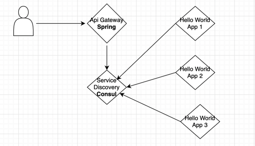
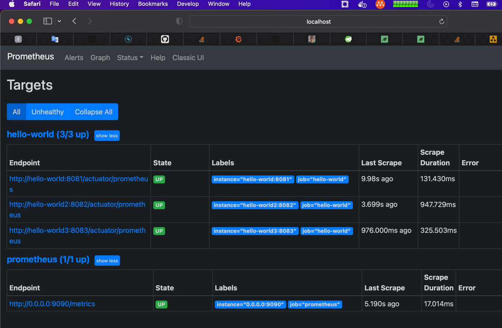
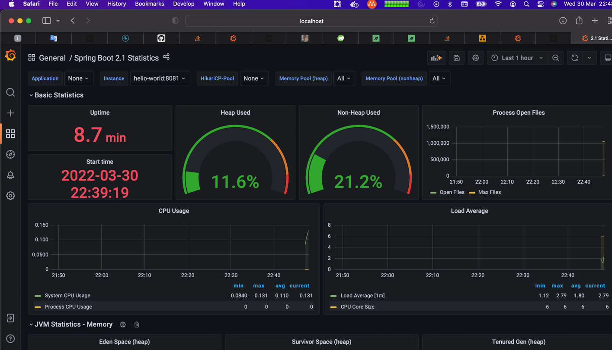

# Hello world app

Sample of Spring Boot App with Redis + Consul + Spring Cloud Gateway

## How that works

### Run by docker

`mvn spring-boot:build-image`

### Run by command line without Redis + Consul

`mvn spring-boot:run -Dspring-boot.run.arguments="--spring.cloud.consul.enabled=false --spring.cloud.consul.discovery.enabled=false --server.port=8084"`

### Using docker-compose

cd docker
docker-compose up

### Using Jmeter

`jmeter -n -t jmeter.jmx -l /tmp/out.txt -e -o /tmp/out_report`

### Accessing API through Gateway
http://localhost:8080/api/people

### Accessing API through Service
http://localhost:808[1|3]

### cURL commands

`curl -v localhost:8080/api/people`
`curl -v "http://localhost:8080/api/people?page=1"`
`curl -v localhost:8080/api/people -H "Content-type: application/json" -d '{"name": "Test"}'`
`curl -v "http://localhost:8080/api/people/{id}`

### Spring Boot Actuator
http://localhost:8080/actuator

### Consul
http://localhost:8500

### Prometheus
http://localhost:9090

### Grafana
http://localhost:3000

### References
https://start.spring.io
https://www.baeldung.com/ops/docker-jvm-heap-size
https://www.baeldung.com/ops/docker-memory-limit